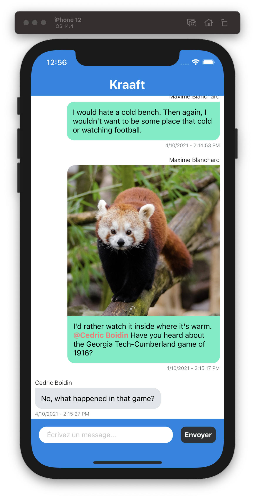
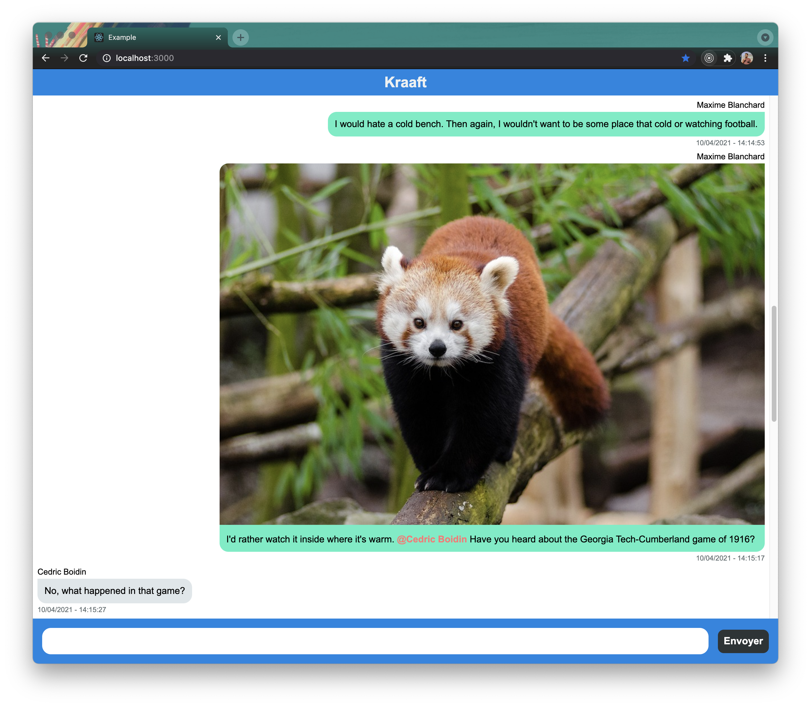

The exercise consists of implementing a conversation app front-end, in react or react-native.

You can choose either the react-native (`native` folder) or the react (`web` folder) implementation.

In both cases, you must implement the `Conversation` component that displays the conversation between multiple users.

- The component should look like the specified design (see attached images). ✔️
- Messages are sorted by creation date, newer messages are displayed at the bottom, older messages at the top. ✔
- Messages width should be at most 80% of the screen width. ✔️
- Messages of type `image` should display the associated image. No specification is given except it should look nice on the few given examples. :-) ✔️
- Current user messages are displayed on the right with a green background. ✔️
- Other users messages are displayed on the left with a grey background. ✔️
- Mentions to users must be automatically detected and displayed in bold and red. A mention is defined by the `@` character followed by the username and not followed by another alpha-numeric character.
- Code is preferably written in Typescript. Javascript is also possible. ✔️

Native design:

Web design:

